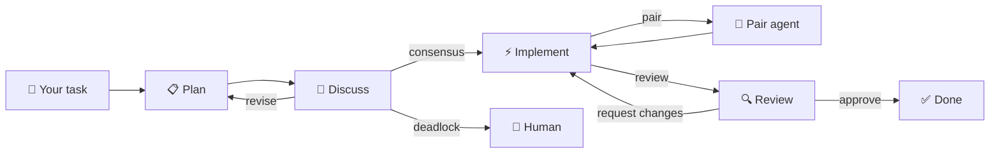

<div align="center">

# 🔀 agent-pipe

### A tiny CLI that lets 🧠 Claude, ⚡ Codex, and 🔍 Gemini collaborate 🤝 like a real engineering team.

**Agents plan together, discuss the approach, implement, and review each other's work — like real engineers.**

[](https://www.npmjs.com/package/agent-pipe)
[](LICENSE)

```
agent-pipe run "implement JWT refresh token flow" --discuss
```

📋 Plan → 💬 Discuss & agree → ⚡ Implement → 🔍 Review (iterate until approved) → ✅ Done

</div>

---

## The Problem

Software engineering teams never let the same person write and review their own code. It's a basic quality principle — the author has blind spots that a fresh pair of eyes will catch. But that's exactly what we do with AI coding agents today.

**🔄 Self-review is broken.** When Claude writes code and Claude reviews it, the same reasoning patterns that introduced a bug will gloss over it during review. The model has consistent blind spots — it won't catch what it can't see. Just like a human developer, it needs a different reviewer.

**🧠 Models think differently.** Claude, GPT/Codex, and Gemini each have distinct reasoning strengths. Claude excels at architecture and planning. Codex is fast and pragmatic at implementation. Gemini brings massive context windows and a different analytical lens. Using a single model for everything wastes the unique perspective each one offers.

**💸 Cost and rate limits are uneven.** Claude Opus produces exceptional reasoning but is expensive and rate-limited. Codex has generous throughput. Gemini offers huge context windows. Today you're forced to pick one and eat the tradeoffs — or manually juggle between them.

**📋 Manual multi-agent is painful.** Engineers who do use multiple AI tools end up as the glue: copy-pasting between CLIs, re-explaining context, losing session continuity, and manually deciding what goes where. The cognitive overhead often negates the benefit.

**🔒 No standard handoff.** Each coding CLI is an island. There's no protocol for one agent to hand structured context to another, no way to say "continue this as the primary thread", "pair with me on this", or "review this before we finish."

### The result?

Most developers settle for a single agent doing everything — driving the task, pairing with itself, and self-reviewing — and accept lower quality output than a multi-perspective workflow would produce. It's the same mistake as skipping code review on a team, but we accept it because orchestrating multiple AI agents was too hard.

---

## The Solution

`agent-pipe` brings the peer review model to AI coding — automatically.

```text
You: agent-pipe run "implement JWT refresh token flow" --discuss

  → 📋 Codex proposes an implementation plan
  → 💬 Claude and Gemini review the plan, raise concerns, suggest alternatives
  → 🤝 Team reaches consensus (or human breaks a tie)
  → ⚡ Codex implements the agreed approach
  → 🔍 Gemini reviews the code — requests specific changes with file:line comments
  → 🔄 Codex fixes the issues, Gemini re-reviews
  → ✅ Approved — you get team-reviewed, multi-perspective code
```

It works by orchestrating real autonomous coding CLIs (Claude Code, Codex, Gemini CLI) into a `plan → discuss → implement → review` flow, using a structured JSON handoff contract. Each agent runs as its own process with full shell access, file editing, and tool use — these aren't simulated personas inside one app.

### ⚡ What you get

|     | Benefit                           | How                                                                                              |
| --- | --------------------------------- | ------------------------------------------------------------------------------------------------ |
| 💬  | **Team discussion before code**   | Agents debate the approach, raise concerns, and reach consensus before anyone writes a line       |
| 🔄  | **Iterative code review**         | Reviewer requests specific changes with file:line comments; implementer fixes; reviewer re-reviews |
| 🔀  | **Cross-model peer review**       | A different model always reviews — catching blind spots the author can't see                     |
| 🧠  | **Right model for the right job** | Let one agent own the task, call in a pair when needed, and route review to fresh eyes           |
| 💰  | **Cost-aware routing**            | Spend expensive tokens on reasoning, use high-throughput models for heavy lifting                |
| 🔗  | **Automatic handoffs**            | No more copy-pasting between tools — structured context flows between agents                     |
| 🧵  | **Session continuity**            | `primary → review → primary` resumes where it left off, not from scratch                         |
| 🛡️  | **Built-in guardrails**           | Review gate, lock file, no-progress detection, and JSONL audit logs                              |
| 🔌  | **Vendor-agnostic**               | Routing is action-based (`primary`, `pair`, `review`) — swap models without changing workflows   |
| 🖥️  | **Terminal-first**                | No IDE lock-in. Works anywhere you have a terminal                                               |

### 🏗️ How it's different

|     | What it's NOT                   | What it IS                                                 |
| --- | ------------------------------- | ---------------------------------------------------------- |
| ❌  | A prompt wrapper over one model | ✅ Coordination of independent, autonomous CLI agents      |
| ❌  | A massive workflow engine       | ✅ A tiny contract, explicit routing, predictable handoffs |
| ❌  | Locked to one vendor            | ✅ Action-based routing with swappable adapters            |
| ❌  | An IDE plugin                   | ✅ A terminal-native pipe between real coding CLIs         |



### 🎯 Who it's for

- You want agents that discuss, agree, implement, and review — like a real engineering team
- You already use one or more coding CLIs and want them to collaborate
- You want better output quality through multi-model planning, discussion, and peer review
- You care about cost optimization across different model tiers
- You want a minimal, inspectable system — not a black box

For architecture details, programmatic usage, and internal APIs, see [API.md](./API.md).

## Contributing

Contributions are welcome.

- Start with [`CONTRIBUTING.md`](./CONTRIBUTING.md) for setup, workflow, testing, and repo conventions.
- Keep changes focused and update docs when behavior changes.
- Open an issue first for larger changes, routing changes, or new adapter ideas so the approach can be aligned before implementation.

## Issues and feature requests

- Use GitHub Issues to report bugs, propose features, or ask for help with routing and adapter behavior.
- Include your `agent-pipe` version, the command you ran, relevant `.agentpipe.json` snippets, and any useful logs from `.agentpipe/runs/`.
- If a run failed because of contract parsing or handoff behavior, include the final JSON block and which agent produced it.

## Table of Contents

- [Quick Start](#quick-start)
- [Prerequisites](#prerequisites)
- [Contributing](#contributing)
- [Issues and feature requests](#issues-and-feature-requests)
- [Installation](#installation)
- [Usage](#usage)
  - [CLI Commands](#cli-commands)
  - [Interactive REPL Mode](#interactive-repl-mode)
  - [CLI Flags](#cli-flags)
  - [Using With Fewer Agents](#using-with-fewer-agents)
- [How It Works](#how-it-works)
  - [Plan and Discuss Phase](#plan-and-discuss-phase)
  - [Review Iteration](#review-iteration)
- [Configuration](#configuration)
  - [Config Reference](#config-reference)
  - [Discussion Config](#discussion-config)
  - [Step Prompts](#step-prompts)
  - [Step Threads and Sessions](#step-threads-and-sessions)
  - [Adapter Modes](#adapter-modes)
  - [Custom Agent Commands](#custom-agent-commands)
- [Contract Schema](#contract-schema)
- [Orchestrator Loop](#orchestrator-loop)
- [Output and Logging](#output-and-logging)
- [Troubleshooting](#troubleshooting)
- [Project Structure](#project-structure)
- [Developer / API Docs](#developer--api-docs)
- [Design Principles](#design-principles)
- [Why This Is Different From Cursor/IDE Multi-Agent](#why-this-is-different-from-cursoride-multi-agent)

---

## Quick Start

```bash
# Install globally
npm install -g coding-agent-git-pipe

# Initialize a repo once
cd /path/to/repo
agent-pipe init

# Edit .agentpipe.json and choose which installed CLIs should be
# your primary, review, and pair agents

# Or run directly with npx (no install needed)
npx coding-agent-git-pipe run "implement JWT refresh token flow"

# If installed globally
agent-pipe run "add dark mode support"

# Enable team discussion before implementation
agent-pipe run "refactor auth module" --discuss

# Interactive REPL mode — just run agent-pipe with no arguments in a terminal
agent-pipe
```

`agent-pipe init` writes a starter routing config. The shipped defaults are `primary=codex`, `review=gemini`, and `pair=claude`, but you should change those to match the CLIs you actually have installed and want to use.

---

## Prerequisites

**Node.js 18+** is required.

You need at least one of the following AI coding CLIs installed and authenticated:

| Agent                                                         | Install                                                                                                   | Auth                            |
| ------------------------------------------------------------- | --------------------------------------------------------------------------------------------------------- | ------------------------------- |
| [Claude Code](https://docs.anthropic.com/en/docs/claude-code) | `npm install -g @anthropic-ai/claude-code`                                                                | `claude` (follow login prompts) |
| [Codex](https://github.com/openai/codex)                      | `npm install -g @openai/codex`                                                                            | Set `OPENAI_API_KEY` env var    |
| [Gemini CLI](https://github.com/google-gemini/gemini-cli)     | `npm install -g @google/gemini-cli` or see [Gemini CLI docs](https://github.com/google-gemini/gemini-cli) | `gemini` (follow login prompts) |

You do **not** need all three. See [Using With Fewer Agents](#using-with-fewer-agents) to configure routing for your setup.

---

## Installation

### Global install (recommended)

```bash
npm install -g coding-agent-git-pipe
```

This gives you two global commands: `agent-pipe` and `cagp` (shorthand).

### npx (no install)

```bash
npx coding-agent-git-pipe run "your task here"
```

### From source

```bash
git clone https://github.com/user/coding-agent-git-pipe.git
cd coding-agent-git-pipe
npm install
npm run build
npm link    # makes agent-pipe and cagp available globally
```

### Verify installation

```bash
agent-pipe --version
agent-pipe --help
```

---

## Usage

### CLI Commands

Use `init` once per repo to create a starter config, then use `run` for actual tasks — or drop into interactive REPL mode.

```bash
# Create .agentpipe.json in the current repo
agent-pipe init

# Create it in another repo root
agent-pipe init --cwd /path/to/repo

# Overwrite an existing config
agent-pipe init --force
```

After `init`, edit `.agentpipe.json` and choose your routing explicitly:

- `routing.primary`: the main working CLI for the run
- `routing.review`: the CLI you want as the review/signoff lane
- `routing.pair`: the advisory CLI used for temporary pair hops

The generated defaults are only a starter template. They are not a requirement, and they are not the right choice for every machine.

Then pass your task as a quoted string, or start interactive mode:

```bash
# Basic usage
agent-pipe run "add JWT refresh token support"

# Shorthand alias works too
agent-pipe run "add user authentication with OAuth2"

# Interactive REPL mode — run tasks interactively without re-typing agent-pipe each time
# (Launches automatically when run with no arguments in a terminal)
agent-pipe
# > add JWT refresh token support --discuss
# > fix login bug --primary-agent claude
# > /help
# > /quit
```

In REPL mode you type a task (with optional flags) and press Enter. The orchestrator runs, then the prompt returns. Use `/help` to show usage, `/quit` (or `/exit`, `/q`, Ctrl+D) to exit.

The orchestrator will:

1. Send your task to the primary agent (Codex by default)
2. Stream the agent's output to your terminal in real time
3. Parse the agent's routing contract
4. Hand off to the next agent automatically
5. Repeat until done or max hops reached

### CLI Flags

| Flag                     | Default           | Description                                                              |
| ------------------------ | ----------------- | ------------------------------------------------------------------------ |
| `--primary-agent <name>` | `codex`           | Override the primary agent for this run (`claude`, `codex`, or `gemini`) |
| `--discuss`              | off               | Enable plan & discuss phase before implementation                       |
| `--max-hops <n>`         | `50`              | Maximum routing hops before stopping                                   |
| `--timeout-ms <n>`       | `1800000`         | Per-agent timeout in milliseconds (default: 30 min)                    |
| `--max-retries <n>`      | `1`               | Contract parse retries before escalating to human                      |
| `--no-progress-hops <n>` | `3`               | Ask human if repo unchanged for N consecutive steps (0 = disabled)     |
| `--ui <mode>`            | `auto`            | UI rendering mode: `auto` (detect TTY), `plain` (text), `tui` (Ink)   |
| `--config <path>`        | `.agentpipe.json` | Path to config JSON file                                               |
| `--cwd <path>`           | Current dir       | Working directory (must be a git repo)                                 |
| `--force`                |                   | `init` only. Overwrite an existing config file                         |
| `-v, --version`          |                   | Show version                                                           |
| `-h, --help`             |                   | Show help                                                              |

**`--ui` modes:**

| Mode    | Behavior                                                                           |
| ------- | ---------------------------------------------------------------------------------- |
| `auto`  | Default. Uses `tui` when both stdin and stdout are a TTY; falls back to `plain`    |
| `plain` | Plain text output — prefixed lines, no Ink rendering. Best for scripts and CI     |
| `tui`   | Ink-based terminal UI with live rendering, contract briefs, and styled human input |

### Examples

```bash
# Team discussion before implementation (plan → discuss → implement → review)
agent-pipe run "add dark mode support" --discuss

# Start with claude as the primary agent, with discussion enabled
agent-pipe run "refactor auth module" --primary-agent claude --discuss

# Quick mode without discussion (direct implementation → review)
agent-pipe run "fix typo in README" --primary-agent claude --max-hops 5

# Longer timeout for complex tasks
agent-pipe run "refactor auth module" --timeout-ms 600000

# Disable no-progress guard (useful for planning-only tasks)
agent-pipe run "analyze codebase architecture" --no-progress-hops 0

# Use a custom config file and different working directory
agent-pipe run "fix login bug" --config ./my-config.json --cwd /path/to/repo
```

### Interactive REPL Mode

Running `agent-pipe` with no arguments in an interactive terminal launches REPL mode:

```
$ agent-pipe

  agent-pipe v1.2.0 — interactive mode
  Type a task (with optional flags) or a command.
  Commands: /help, /quit

> add JWT refresh token support --discuss
> fix login bug --primary-agent claude --max-hops 5
> /help
> /quit
```

- Type a task with any `run` flags inline and press Enter to start an orchestration run.
- After the run completes the prompt returns — you can immediately type the next task.
- `/help` — show usage text inline.
- `/quit`, `/exit`, `/q` — exit REPL mode.
- `Ctrl+D` — exit REPL mode.

REPL mode does not launch in non-TTY environments (pipes, CI). Running `agent-pipe` with no arguments in a pipe prints the help text and exits.

### Using With Fewer Agents

You don't need all three agents. Configure `.agentpipe.json` to route all actions to the agent(s) you have:

**Claude only:**

```json
{
  "routing": {
    "primary": "claude",
    "review": "claude",
    "pair": "claude",
    "ask-human": "human",
    "done": "stop"
  }
}
```

**Claude + Codex (no Gemini):**

```json
{
  "routing": {
    "primary": "codex",
    "review": "claude",
    "pair": "claude",
    "ask-human": "human",
    "done": "stop"
  }
}
```

**Codex only:**

```json
{
  "routing": {
    "primary": "codex",
    "review": "codex",
    "pair": "codex",
    "ask-human": "human",
    "done": "stop"
  }
}
```

---

## How It Works

```
You: agent-pipe run "implement JWT refresh token flow" --discuss

  === plan & discuss phase ===
  Codex proposes: "Add JWT middleware with refresh token rotation"
  Claude reviews: agree (no concerns)
  Gemini reviews: partial ("consider token revocation list")
  Codex revises: "Added revocation check to approach"
  Claude reviews: agree
  Gemini reviews: agree
  === consensus reached ===

  === implementation phase ===
  Codex implements the agreed plan
  Codex -> Gemini (review)
  Gemini -> request-changes: "Missing null check at src/auth.ts:15"
  Codex fixes the issue
  Codex -> Gemini (re-review)
  Gemini -> approve
  === done ===

You come back to a team-planned, team-reviewed implementation.
```

### Plan and Discuss Phase

When `--discuss` is enabled (or `discussion.enabled` is `true` in config), the orchestrator runs a multi-agent planning session before any code is written:

1. **Plan**: The primary agent analyzes the task and proposes an approach — what to build, how to build it, which files to touch.
2. **Discuss**: Each participant (other configured agents) reviews the proposal. They return a `sentiment` (agree/disagree/partial) and list specific `concerns`.
3. **Consensus check**: If all participants agree with no concerns, the proposal is approved. If `require_consensus` is false, partial agreement (no one disagrees) is enough.
4. **Revision**: If there's disagreement, the proposer sees all feedback and revises the approach. Participants review again.
5. **Deadlock**: After `max_rounds` without consensus, the human is asked to decide.

The approved plan becomes the implementation task, giving the primary agent a clear, team-vetted blueprint to follow.

### Review Iteration

Instead of a one-shot review gate, the review step now supports iterative review:

1. The reviewer examines the code and returns a `review_verdict`: `approve`, `request-changes`, or `reject`.
2. On `request-changes`, the reviewer includes `review_comments` with specific `file`, `line`, and `comment` for each issue.
3. The orchestrator automatically routes back to the primary agent with the formatted review feedback.
4. The primary agent addresses the comments, then goes back to review.
5. This repeats up to `max_review_iterations` (default: 3) until approved.

This mirrors how real code review works — not a rubber stamp, but an iterative conversation between implementer and reviewer.

---

In `auto` mode (default), each agent:

- Reads and writes files in the repo directly
- Runs commands (tests, linters, builds)
- Commits code if needed
- Only outputs a small JSON contract at the end to say "what should happen next"

In `print` mode, agents produce text-only output (planning, analysis, feedback) without modifying the repo.

The repo itself is shared state — agents read code directly from disk, not from messages. This keeps the contract small and agents fast.

---

## Configuration

Create `.agentpipe.json` at your repo root (optional — all fields have sensible defaults):

```bash
agent-pipe init
```

```json
{
  "routing": {
    "primary": "codex",
    "review": "gemini",
    "pair": "claude",
    "ask-human": "human",
    "done": "stop"
  },
  "max_hops": 50,
  "agent_timeout_ms": 1800000,
  "max_invalid_contract_retries": 1,
  "no_progress_hops": 3,
  "lock_file": ".agentpipe.lock",
  "log_dir": ".agentpipe/runs",
  "review_gate": true,
  "discussion": {
    "enabled": false,
    "participants": [],
    "max_rounds": 3,
    "require_consensus": true
  },
  "max_review_iterations": 3,
  "agent_timeouts_ms": {},
  "adapter_modes": {},
  "adapter_args": {},
  "adapters": {},
  "step_prompts": {
    "primary": [],
    "review": [],
    "pair": []
  }
}
```

All fields are optional. Defaults are applied for anything not specified.

The most important thing to set after `init` is `routing`:

- choose which installed CLI should own `primary`
- choose which installed CLI should own `review`
- choose which installed CLI should own `pair`

If you only use one or two CLIs, route the unused actions to the tools you do have instead of keeping the starter defaults.

Add to your `.gitignore`:

```
.agentpipe.lock
.agentpipe/
```

### Config Reference

| Field                          | Type                             | Default                                                      | Description                                                                                  |
| ------------------------------ | -------------------------------- | ------------------------------------------------------------ | -------------------------------------------------------------------------------------------- |
| `routing`                      | `Record<action, target>`         | primary->codex, review->gemini, pair->claude                 | Maps actions to agents. These are starter defaults from `init`; set them to the CLIs you actually use. Targets: `claude`, `codex`, `gemini`, `human`, `stop` |
| `max_hops`                     | `number`                         | `50`                                                         | Max routing hops before stopping                                                             |
| `agent_timeout_ms`             | `number`                         | `1800000` (30min)                                            | Default per-agent timeout                                                                    |
| `max_invalid_contract_retries` | `number`                         | `1`                                                          | Retries for invalid contract output                                                          |
| `no_progress_hops`             | `number`                         | `3`                                                          | Ask human if repo unchanged for N hops (0 = disabled)                                        |
| `lock_file`                    | `string`                         | `".agentpipe.lock"`                                          | Lock file path for concurrency protection                                                    |
| `log_dir`                      | `string`                         | `".agentpipe/runs"`                                          | JSONL log directory                                                                          |
| `review_gate`                  | `boolean`                        | `true`                                                       | If enabled, `primary -> done` is forced through `review` whenever repo state changed since the last review (or repo state is unavailable) |
| `discussion`                   | `object`                         | see [Discussion Config](#discussion-config)                   | Plan & discuss phase settings                                                                |
| `max_review_iterations`        | `number`                         | `3`                                                          | Max review→fix→re-review cycles before the review verdict is accepted as-is                   |
| `agent_timeouts_ms`            | `Record<agent, number>`          | `{}`                                                         | Per-agent timeout overrides                                                                  |
| `adapter_modes`                | `Record<agent, "print"\|"auto">` | `{}` (all default to `auto`)                                 | Per-agent execution mode                                                                     |
| `adapter_args`                 | `Record<agent, string[]>`        | `{}`                                                         | Extra CLI flags appended to the resolved adapter command                                     |
| `adapters`                     | `Record<agent, string[]>`        | `{}`                                                         | Per-agent command override                                                                   |
| `step_prompts`                 | `Record<scope, string[]>`        | all empty arrays                                             | Hidden prompt instructions scoped to `primary`, `review`, or `pair`                          |

### Discussion Config

The `discussion` object controls the plan & discuss phase:

| Field               | Type         | Default | Description                                                                  |
| ------------------- | ------------ | ------- | ---------------------------------------------------------------------------- |
| `enabled`           | `boolean`    | `false` | Enable the plan & discuss phase (or use `--discuss` CLI flag)                |
| `participants`      | `AgentName[]`| `[]`    | Which agents participate in discussion. Empty = auto-infer from routing      |
| `max_rounds`        | `number`     | `3`     | Maximum discussion rounds before escalating to human                         |
| `require_consensus` | `boolean`    | `true`  | If false, partial consensus (no disagreements) is enough to proceed          |

When `participants` is empty, the orchestrator infers participants from the routing table — all unique agents that aren't the primary proposer.

Example — enable discussion with relaxed consensus:

```json
{
  "discussion": {
    "enabled": true,
    "participants": ["claude", "gemini"],
    "max_rounds": 2,
    "require_consensus": false
  }
}
```

### Step Prompts

Use `step_prompts` when you want to bias behavior by stage without changing the visible task text.

- `primary`, `review`, and `pair` apply based on the routed action for the current hop, not the agent name.
- These instructions are injected into the agent prompt invisibly; they do not print to the terminal.

Example:

```json
{
  "step_prompts": {
    "primary": ["Focus on concrete repo changes and validation."],
    "review": ["Review for correctness, regressions, and missing tests."],
    "pair": [
      "Provide expert advice, suggestions, and approach validation. Do not modify code."
    ]
  }
}
```

### Step Threads and Sessions

`agent-pipe` now keeps one logical thread per agent CLI instead of treating every hop as a blank one-shot exchange.

- Default thread keys are the agent names themselves: `codex`, `gemini`, and `claude`.
- If the same CLI is used again later, even from a different orchestration scope, that same logical session is resumed.
- Pair hops no longer create separate `pair:<origin>` namespaces. If `claude` is your pair agent, all pair hops in the run reuse the same Claude session.
- Built-in adapters reuse native CLI session ids when available. For Codex, `agent-pipe` also falls back to Codex's local state DB if `exec --json` does not emit the session id in stdout.
- When a custom adapter cannot resume natively, `agent-pipe` falls back to prompt replay for continuity.
- When a step resumes, the prompt only includes the new handoff plus turns since that thread last ran. Older context stays in the native CLI session instead of being replayed every time.

### Better Handoffs

Every agent prompt now includes a hidden handoff rubric.

- Agents are told to treat the current handoff as primary task state.
- When they route to another action, they are told to make `message` a concise technical handoff rather than a vague summary.
- The intended shape is: current state or diagnosis, exact next task, and any relevant files, tests, commands, or constraints.
- The handoff stays compact; this is meant to improve precision, not add long prose.

### Review Gate

By default, `agent-pipe` treats `review` as the final acceptance gate for changed repo state.

- If a `primary` step emits `done` after the repo changed since the last review, the orchestrator redirects that completion to the configured `review` route first.
- If the repo state is unchanged since the last review, `primary -> done` is allowed to pass through directly.
- If repo state cannot be determined, the gate stays conservative and still routes through `review`.
- A `review` step can still emit `done` normally.
- Set `"review_gate": false` if you want to allow `primary -> done` without this automatic review enforcement.

### Review Iteration

When the review agent includes `review_verdict: "request-changes"` in its contract, the orchestrator automatically:

1. Formats the `review_comments` into a structured feedback message (with file:line references).
2. Routes back to the primary agent with the feedback.
3. The primary agent addresses the comments.
4. The review agent re-reviews.

This repeats up to `max_review_iterations` (default 3). After that limit, the review verdict is accepted as-is and passes through to the done gate.

Set `max_review_iterations` to control how many review cycles are allowed:

```json
{
  "max_review_iterations": 5
}
```

### Adapter Modes

Each agent can run in one of two modes:

| Mode             | Behavior                                                             |
| ---------------- | -------------------------------------------------------------------- |
| `auto` (default) | Full autonomous agent with file editing, command execution, tool use |
| `print`          | Text-only output, no tool use or file modifications                  |

The actual commands invoked per mode:

| Agent  | `auto`                                        | `print`                                 |
| ------ | --------------------------------------------- | --------------------------------------- |
| claude | `claude --dangerously-skip-permissions -p`    | `claude -p --tools ""`                  |
| codex  | `codex exec --skip-git-repo-check --json` | Not supported (use `adapters` override) |
| gemini | `gemini -o stream-json`                       | Not supported (use `adapters` override) |

Set `"print"` for Claude when you only want text output (e.g., for planning-only steps):

```json
{
  "adapter_modes": {
    "claude": "print"
  }
}
```

### Custom Agent Commands

Override the exact command used for any agent with the `adapters` field. This takes priority over `adapter_modes`.

```json
{
  "adapters": {
    "claude": ["claude", "--dangerously-skip-permissions", "--model", "opus"]
  }
}
```

You can even swap in a completely different tool (e.g., aider) by routing to an agent slot and overriding its command:

```json
{
  "routing": {
    "primary": "codex"
  },
  "adapters": {
    "codex": ["aider", "--yes", "--message"]
  }
}
```

This routes `primary` actions to the `codex` slot but runs `aider` instead.

Use `adapter_args` when you want to keep the built-in adapter behavior but add flags like model selection, sandbox, or permission settings.

Examples:

```json
{
  "adapter_args": {
    "claude": ["--model", "opus", "--permission-mode", "auto"],
    "codex": ["--full-auto", "-m", "gpt-5.4"],
    "gemini": ["--model", "gemini-2.5-pro"]
  }
}
```

This is usually better than a full `adapters` override because built-in streaming and native session-resume behavior stay intact.

---

## Contract Schema

Every agent response must end with a JSON contract. This is how agents tell the orchestrator what should happen next:

```json
{
  "contract_version": "1",
  "next_action": "primary | review | pair | ask-human | done",
  "to": "(optional) primary | review | pair | ask-human | done",
  "message": "concise technical handoff for the next step",
  "questions": [{ "id": "q1", "text": "Only used when next_action=ask-human" }],
  "sentiment": "(optional) agree | disagree | partial | neutral",
  "concerns": ["(optional) list of technical concerns"],
  "proposal": { "summary": "...", "approach": "...", "files": ["..."] },
  "review_verdict": "(optional) approve | request-changes | reject",
  "review_comments": [{ "file": "path", "line": 42, "comment": "issue" }],
  "confidence": 0.85
}
```

### Core Fields

| Field              | Required             | Description                                           |
| ------------------ | -------------------- | ----------------------------------------------------- |
| `contract_version` | Yes                  | Always `"1"`                                          |
| `next_action`      | Yes                  | What should happen next                               |
| `to`               | No                   | Override routing (uses action names, not agent names) |
| `message`          | Yes                  | Concise technical handoff passed to the next step     |
| `questions`        | Only for `ask-human` | Questions for the human to answer                     |

### Discussion Fields (used during plan & discuss phase)

| Field              | Required   | Description                                                       |
| ------------------ | ---------- | ----------------------------------------------------------------- |
| `sentiment`        | No         | Agent's position: `agree`, `disagree`, `partial`, or `neutral`    |
| `concerns`         | No         | Array of specific technical concerns                              |
| `proposal`         | No         | Proposed approach: `{ summary, approach, files? }`                |
| `confidence`       | No         | Confidence score from 0 to 1                                     |

### Review Fields (used during review phase)

| Field              | Required   | Description                                                       |
| ------------------ | ---------- | ----------------------------------------------------------------- |
| `review_verdict`   | No         | Review result: `approve`, `request-changes`, or `reject`          |
| `review_comments`  | No         | Array of `{ file?, line?, comment }` with specific code issues    |

**Important:** `to` uses action names (`primary`, `review`, `pair`) — never agent names. The routing config maps actions to agents internally. This keeps routing action-based instead of model-specific.

### Pair Action

The `pair` action enables pair-programming sessions. When an agent emits `next_action: "pair"`, the orchestrator:

1. Saves the current agent as the "return-to" target.
2. Routes to the configured pair agent (default: `claude`).
3. The pair agent provides advice, suggestions, or approach validation.
4. After the pair agent responds, the orchestrator **automatically returns** to the original invoking agent with the pair agent's response as the message.

The return is forced regardless of what the pair agent sets as its own `next_action`. Pair is advisory-only: the pair agent does not control routing. `agent-pipe` ignores pair-step `next_action` / `to` values and uses only the returned `message` before returning to the caller. Nested pair calls are not supported — if the pair agent emits `pair`, it is treated as a normal routing action.

### Done Gate

When a contract resolves to `done -> stop`, the run no longer exits immediately.

1. The agent's completion message is shown through the human gate.
2. You can reply with `finish` or `/finish` to end the run.
3. You can reply with `continue` to enter a second follow-up message prompt.
4. Any other non-empty reply is treated as a direct follow-up and continues immediately.

In all continue cases, the follow-up goes back to the same agent and the same saved logical agent session that emitted `done`. Outside the done gate, `/finish` also works from any human pause (`ask-human`, failures, and no-progress prompts).

---

## Orchestrator Loop

1. Start run with task string.
2. Acquire lock file (prevents concurrent runs in the same repo).
3. **Plan & discuss phase** (if enabled):
   - Primary agent proposes an approach with `proposal` field.
   - Each participant reviews with `sentiment` and `concerns`.
   - On disagreement, proposer revises. Repeat up to `max_rounds`.
   - On consensus, the approved plan becomes the implementation task.
   - On deadlock, human decides.
4. Invoke the primary agent with task + contract instructions.
5. Stream stdout/stderr to terminal live (prefixed with agent name).
6. Parse the final JSON contract block from output.
7. Validate contract fields (including v2 fields like `review_verdict`, `review_comments`).
8. Route to next target via config routing table.
9. **Review iteration**: if reviewer returns `review_verdict: "request-changes"`, auto-route back to primary with formatted comments. Repeat up to `max_review_iterations`.
10. On `pair` action: save return context, route to pair agent, then auto-return after one hop.
11. On target `human` (default for `ask-human`) or failures: pause for human input.
12. On `done -> stop`: open the human finish/continue gate. On `finish` or `/finish`, stop. On `continue`, resume the same logical agent session.
13. Check no-progress guard (git state unchanged for too many steps?).
14. Write JSONL event log per step. Release lock on exit/signals.

The orchestrator maintains a rolling conversation history (last 4 turns) and separate per-agent session state so returning to the same CLI later can continue naturally instead of restarting from scratch.

---

## Output and Logging

### Terminal output

Agent output is streamed live to your terminal, prefixed with the agent name:

```
[codex][primary] I’ll add JWT refresh token support and validate the auth flow.
[codex][primary] Running tests...
[claude][pair] Consider rotating refresh tokens on every successful exchange.
[gemini][review] I found one missing edge case around revoked tokens.
```

A heartbeat message (`... still working`) appears every 10 seconds if an agent produces no output, so you know the process hasn't hung.

### JSONL logs

Every run produces a detailed JSONL log at `.agentpipe/runs/{runId}.jsonl`. Each line is a timestamped JSON event:

```jsonl
{"ts":"2026-03-05T10:00:00.000Z","run_id":"abc-123","type":"run_started","primary_agent":"codex","max_hops":50}
{"ts":"2026-03-05T10:00:00.100Z","run_id":"abc-123","type":"step_started","step_id":1,"agent":"codex","step_scope":"primary"}
{"ts":"2026-03-05T10:02:30.000Z","run_id":"abc-123","type":"step_contract","step_id":1,"contract":{...}}
{"ts":"2026-03-05T10:05:00.000Z","run_id":"abc-123","type":"run_completed","status":"done"}
```

Event types: `run_started`, `step_started`, `thread_session_started`, `thread_session_resumed`, `agent_invocation`, `contract_retry`, `contract_invalid`, `step_contract`, `step_failed`, `routing_failed`, `human_response`, `no_progress_check`, `pair_invoked`, `pair_return`, `review_gate_redirect`, `review_iteration_redirect`, `review_approved`, `discussion_phase_started`, `discussion_phase_completed`, `plan_phase_started`, `plan_phase_completed`, `discussion_round_started`, `discussion_feedback`, `discussion_consensus`, `discussion_deadlock`, `proposal_revision_started`, `proposal_revised`, `done_gate_opened`, `done_gate_finish`, `done_gate_continue`, `run_completed`, `signal`, `run_finalized`.

---

## Troubleshooting

### "command not found: claude" (or codex, gemini)

The AI CLI is not installed or not in your PATH. Install it:

```bash
npm install -g @anthropic-ai/claude-code   # Claude
npm install -g @openai/codex                # Codex
```

### "Lock file exists" error

Another `agent-pipe` run is active in this repo, or a previous run crashed without releasing its lock. The orchestrator checks if the PID in the lock is still alive — if the process died, it reclaims the lock automatically. If you're sure no run is active:

```bash
rm .agentpipe.lock
```

### Agent keeps producing invalid contracts

Increase retries: `--max-retries 3`. If persistent, the agent may not be following the contract format. Check the JSONL log for `contract_invalid` events with the raw output.

### "No progress" keeps asking for human input

The no-progress guard triggers when the git repo state (HEAD + working tree) is unchanged for `no_progress_hops` consecutive steps. This often happens during planning-only tasks. Disable it:

```bash
agent-pipe run "analyze this code" --no-progress-hops 0
```

### Agent times out

Default timeout is 30 minutes per agent. For complex tasks:

```bash
agent-pipe run "large refactoring task" --timeout-ms 3600000   # 1 hour
```

Or set per-agent timeouts in config:

```json
{
  "agent_timeouts_ms": {
    "codex": 3600000
  }
}
```

### Run seems stuck / no output

Wait 10 seconds — a heartbeat message will appear if the agent is still running. AI agents can take time on complex tasks, especially in `auto` mode when they're running commands.

---

## Tests

```bash
npm test
```

Uses Node.js built-in test runner with `tsx` for TypeScript support. Tests use runtime injection to stub agent invocations — no real AI CLIs needed.

---

## Project Structure

```
bin/cli.js              CLI entry point (loads built dist)
src/
  cli.ts                Argument parsing, validation, REPL loop, and main entry
  types.ts              All TypeScript interfaces (Contract v2, DiscussionConfig, UiMode, etc.)
  config.ts             Config loader with defaults and validation
  contract.ts           Contract schema validation (v1 core + v2 optional fields)
  parser.ts             JSON contract extraction from agent output
  router.ts             Action-to-agent routing
  orchestrator.ts       Main run loop (phases, review iteration)
  discussion.ts         Plan & discuss engine (proposal, consensus, revision)
  run-ui.ts             RunSurface abstraction — plain and TUI rendering surfaces
  human-gate.ts         Readline-based human input fallback
  runtime.ts            Lock file, JSONL logger, timeout resolution
  git-state.ts          Git repo state detection (HEAD + status)
  ui.ts                 Shared UI string formatters (banners, notes, prefixes)
  adapters/
    index.ts            Agent dispatcher
    base.ts             Spawn + capture logic, mode-based command resolution
    claude.ts           Claude Code adapter (stream-json parsing)
    codex.ts            Codex adapter (JSON line parsing)
    gemini.ts           Gemini adapter (stream-json delta parsing)
  ink/
    runtime.ts          Ink runtime loader (lazy import, TTY detection)
    App.tsx             Top-level Ink application shell
    ReplApp.tsx         REPL mode prompt component
    InputOnly.tsx       Minimal human-input component (used during askHumanInput)
    RunView.tsx         Live run output view
    AgentOutput.tsx     Streaming agent output display
    HumanInput.tsx      Human input form with heading/footer
    SingleLineTextBox.tsx  Single-line input with prefix
    Spinner.tsx         Spinner indicator
    normalizeSingleLineInput.ts  Input normalization helper
tests/
  contract.test.ts      Contract validation tests (v1 + v2 fields)
  parser.test.ts        Parser extraction tests
  orchestrator.test.ts  End-to-end orchestrator tests (incl. review iteration, discussion)
  discussion.test.ts    Discussion engine tests (consensus, revision, deadlock)
  run-ui.test.ts        RunSurface and output extraction tests
  ink-single-line-text-box.test.ts  SingleLineTextBox component tests
  cli.test.ts           CLI argument parsing, REPL tokenizer, and validation tests
  adapter-base.test.ts  Base adapter tests
  claude-adapter.test.ts
  codex-adapter.test.ts
  gemini-adapter.test.ts
```

---

## Developer / API Docs

For programmatic usage, custom adapters, runtime injection, and internal module contracts, see **[API.md](./API.md)**.

Quick example — embedding the orchestrator in your own tool:

```typescript
import { runOrchestrator } from "coding-agent-git-pipe/src/orchestrator";

const result = await runOrchestrator({
  task: "implement JWT refresh token flow",
  primaryAgent: "codex",
  maxHops: 5,
  cwd: "/path/to/repo",
});

console.log(result.status); // "done" | "max-hops"
console.log(result.hops); // number of steps taken
```

---

## Design Principles

1. **Keep the orchestrator dumb.** Logic lives in agent prompts, not the pipe.
2. **Keep the contract small.** Core routing fields + optional phase-specific fields. No code payloads.
3. **Repo is shared state.** Agents read code directly. No code payloads in the contract.
4. **Keep routing action-based.** No agent names in the contract. Only abstract actions.
5. **Interrupt human only when needed.** On `ask-human`, deadlocks, parse failures, or safety limits.
6. **Discuss before implementing.** Multiple perspectives catch design flaws before they become code.
7. **Review iteratively.** Real code review is a conversation, not a rubber stamp.

---

## Why This Is Different From Cursor/IDE Multi-Agent

Cursor and similar IDE tools can spin up multiple sub-agents with custom personas and models. But they can't orchestrate powerful standalone agentic coding CLIs like Claude Code, Codex, or [Gemini CLI](https://github.com/google-gemini/gemini-cli) — each of which is a full autonomous system with its own shell access, tool use, and execution environment.

This project makes those independent CLI agents work together. Each agent runs as its own process with full autonomy over the repo. The orchestrator is just a pipe between them.
